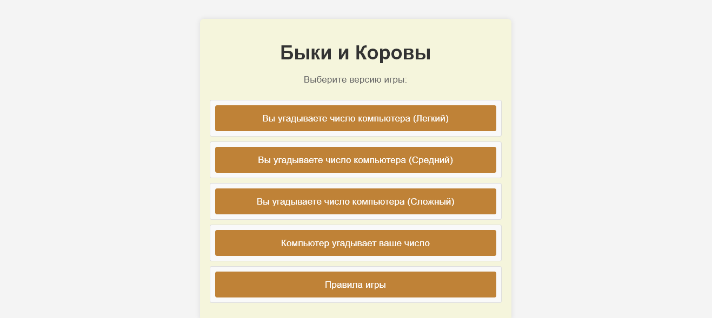
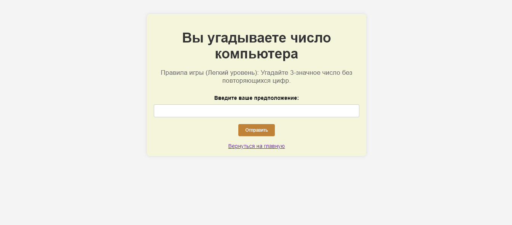
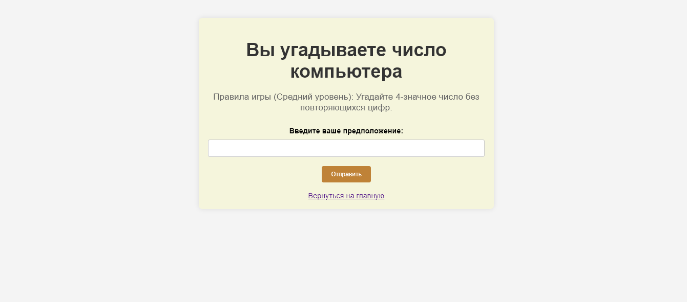
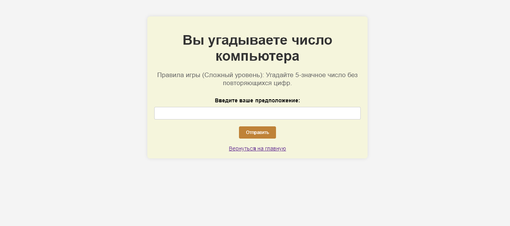
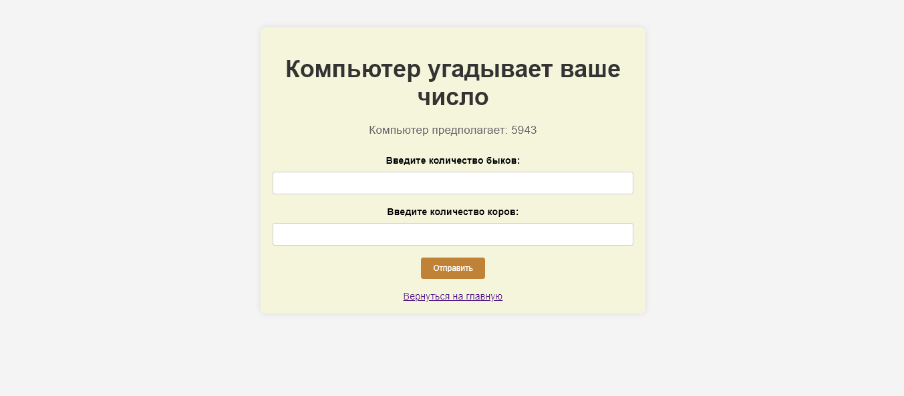
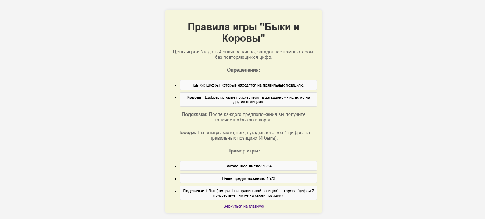

# Игра "Быки и коровы"

Это веб-приложение на Flask для классической игры "Быки и коровы". Игра имеет два режима: пользователь угадывает число компьютера, и компьютер угадывает число пользователя

## Требования

- Python 3.x
- Flask

## Установка

1. Клонируйте репозиторий
    ```bash
   git clone https://github.com/Irina-pr98/Bulls-and-cows-game.git
   ```

2. Создайте виртуальное окружение
    ```bash
   python -m venv venv
   source venv/bin/activate
   # На Windows используйте `venv\Scripts\activate`
    ```
   
3. Установите необходимые пакеты
    ```bash
   pip install -r requirements.txt
    ```
   
4. Запустите приложение
   ```bash
    python app.py
    ```
   
## Использование

Откройте веб-браузер и перейдите по адресу `http://127.0.0.1:5000`. Вы увидите меню со следующими опциями:
- **Вы угадываете число компьютера (Легкий)**: Угадайте 3-значное число
- **Вы угадываете число компьютера (Средний)**: Угадайте 4-значное число
- **Вы угадываете число компьютера (Сложный)**: Угадайте 5-значное число
- **Компьютер угадывает ваше число**: Компьютер будет угадывать ваше 4-значное число
- **Правила игры**: Просмотр правил игры

## Структура проекта

- `app.py`: Основное приложение Flask
- `templates/index.html`: Главная страница меню
- `templates/user_guesses.html`: Страница, где пользователь угадывает число компьютера
- `templates/computer_guesses.html`: Страница, где компьютер угадывает число пользователя
- `templates/rules.html`: Страница с правилом игры
- `static/style.css`: Таблица стилей для приложения

## Скриншоты












